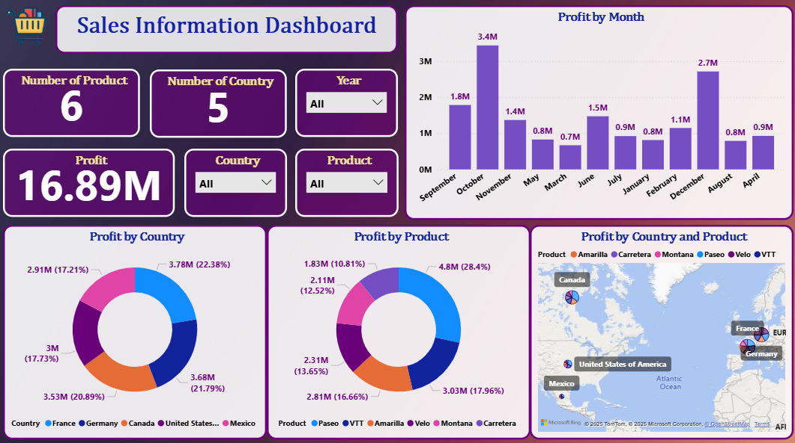

# 📊 Sales Information Analysis

A **Sales Information Dashboard** developed in **Power BI** that provides a complete overview of business performance across different products and countries. The dashboard visualizes essential KPIs such as total profit, number of products, number of countries, and monthly performance trends — enabling business leaders to make **data-driven decisions** quickly and effectively.

---

## 📝 Project Description

This project focuses on transforming raw sales data into an insightful and interactive Power BI dashboard. It presents a clear summary of the company’s **profit distribution**, **regional performance**, and **product-level sales**.

The dashboard contains multiple interactive visuals such as KPI cards, bar charts, donut charts, and a geographic map view — allowing users to explore sales information by **Year**, **Country**, and **Product**.

By leveraging **Power BI**, **DAX**, and **Power Query**, this project demonstrates how data visualization can simplify complex business datasets into meaningful insights.

---

## 🚀 Key Objectives

- Track and visualize **total sales and profit** trends.  
- Identify **top-performing countries** and **products**.  
- Compare **monthly profit variations** across the year.  
- Provide **filtering options** for customized analysis.  
- Deliver a **visually appealing and business-focused** dashboard.

---

## 🧾 Key Metrics

| Metric | Value |
|--------|--------|
| **Total Profit** | 16.89M |
| **Number of Products** | 6 |
| **Number of Countries** | 5 |
| **Top Month** | October (3.4M profit) |
| **Top Product** | VTT (4.8M profit) |
| **Leading Country** | Germany (3.78M profit) |

---

## 📈 Dashboard Preview

---

## 🧠 Insights

- **Germany** achieved the highest total profit (3.78M).  
- **October** was the most profitable month (3.4M).  
- **VTT** product generated the maximum profit share (28.4%).  
- Visual filters allow users to analyze by **year**, **country**, or **product**.  
- Regional distribution reveals strong performance across **Europe** and **North America**.

---

## 🧰 Tools & Technologies

- **Microsoft Excel:** Data cleaning and preparation.
- **Power BI:** Dashboard creation & visualization.
- **DAX:** Calculated measures and KPIs.
- **Power Query:** Data transformation and modeling.

---

## 📊 Dashboard Features

✅ Interactive charts and slicers  
✅ KPI summary cards  
✅ Profit comparison by month, country, and product  
✅ Geographic profit visualization  
✅ Filtered and dynamic insights  

